# FlexEEG Setup
## Prerequisites
- Download MATLAB R2020a (choose all packages during installation)
- Download the FlexEEG folder from [here](https://drive.google.com/drive/folders/1wZiwIIE4kza5pSbYMYhSJmeQJkbHw0cx)
- Download the NeuroSensi Tiernan folder from [here](https://drive.google.com/drive/folders/1wZiwIIE4kza5pSbYMYhSJmeQJkbHw0cx)

note - The FlexEEG folder contains the code to connect the EEG, the Neurosensi Tiernan folder contains the neurogame

## Steps
1. Open MATLAB R2020a and open the FBCSP 2022-CL folder in MATLAB. note - it should be inside FlexEEG/New FlexEEG Folder. The direct link is here if needed: [FBCSP 2022-CL](https://drive.google.com/drive/folders/17eBkxO1bWOJFypiZSGquhmjYiHRiOqzY)
An easy way to open the folder is to paste the path into the textbox underneath the feature ribbon
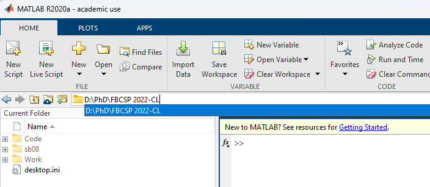
2. in the MATLAB command window run the following:
~~~
%{
    This code block does the following:
    - Navigate to the toolbox folder
    - get full path of input dlg
    - remove inputdlg.m from full path to get directory path
    - copy newid.m to the folder path
    - rehash the toolbox to pick up changes
}
cd 'Toolboxes for FBCSP' %navigate to toolbox folder
filepath = which('inputdlg','-all'); %get path of input dlg

%remove '\inputdlg.m' to get directory path
folderpath = strrep(filepath{1}, '\inputdlg.m',''); 

copyfile('newid.m',folderpath); %copy file
%rehash the toolbox cache to pick up changes
rehash('toolboxcache')
~~~
    This code block effectively follows the instructions in Toolboxes for FBCSP\ReadmeforNewID.txt which lists steps for copying newid.m to the Matlab ui tools folder on your pc

3. Navigate to the Matlab file explorer and right click on the folder called "add to path" then click on "Add to path" and select all folders and subfolders 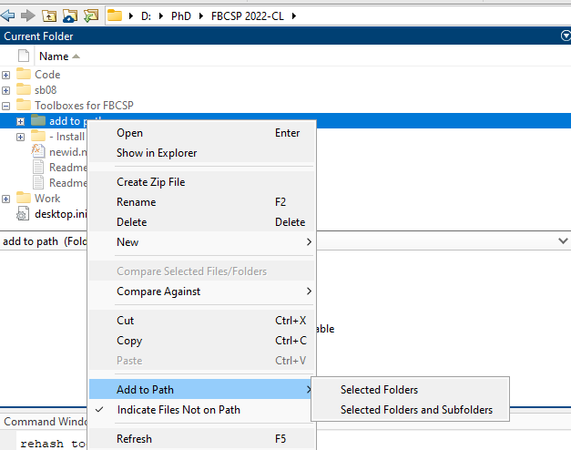
Alternatively, this can also be done by running the following code in the command window if you are still in the Toolboxes for FBCSP directory:
~~~
addpath(genpath(append(pwd, '\add to path')))
~~~
1. Navigate to the '- Install' folder inside of 'Toolboxes for FBCSP'. Then go inside of the folder Biosig 3.2.0, there should be another Biosig 3.2.0 folder. Go into it. If Biosig 3.2.0 is a zip then extract the contents to 'Biosig 3.2.0' and then go inside of it.
You navigate to this folder from the toolboxes folder using: 
~~~
cd '- Install'\'Biosig 3.2.0'\'Biosig 3.2.0'\
~~~
1. Open the biosig_installer.m script and run it. This can be done via the ribbon bar menu in Editor\Run as shown in the following image:
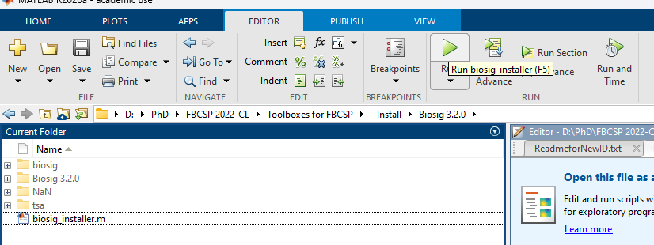
Alternatively you could also click f5 once the script is open. Or you can use the following code in the command window if you are still inside 'Biosig 3.2.0':
~~~
run('biosig_installer.m')
~~~
6. After the script has been run successfully run the following command in the command window: 
~~~
savepath
~~~
7. turn on your flex eeg device
8. Go to bluetooth settings then click add device
9. The name will be something like flex-XXXX or NCBT-XXXX:
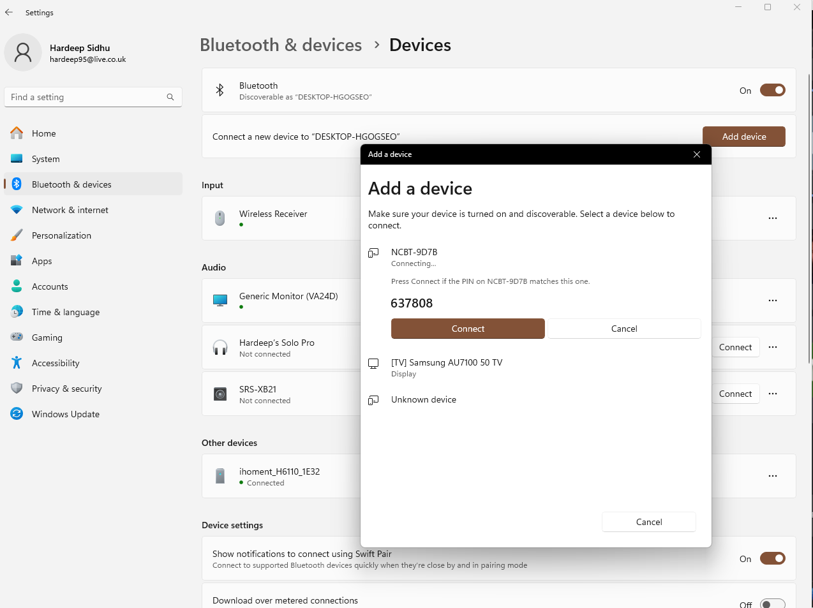
10. Scroll down to more bluetooth settings and click on it
 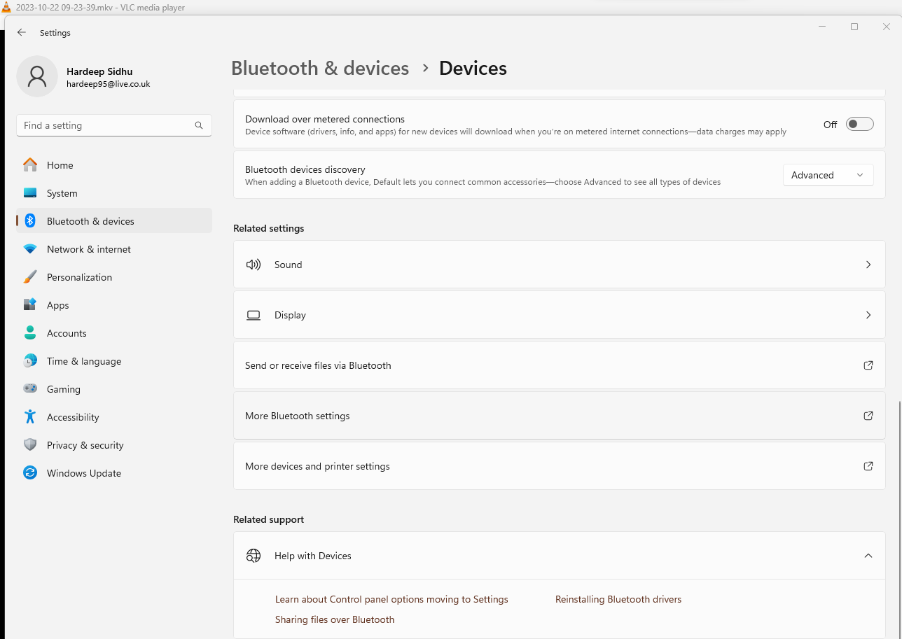
11. You will be shown this screen: 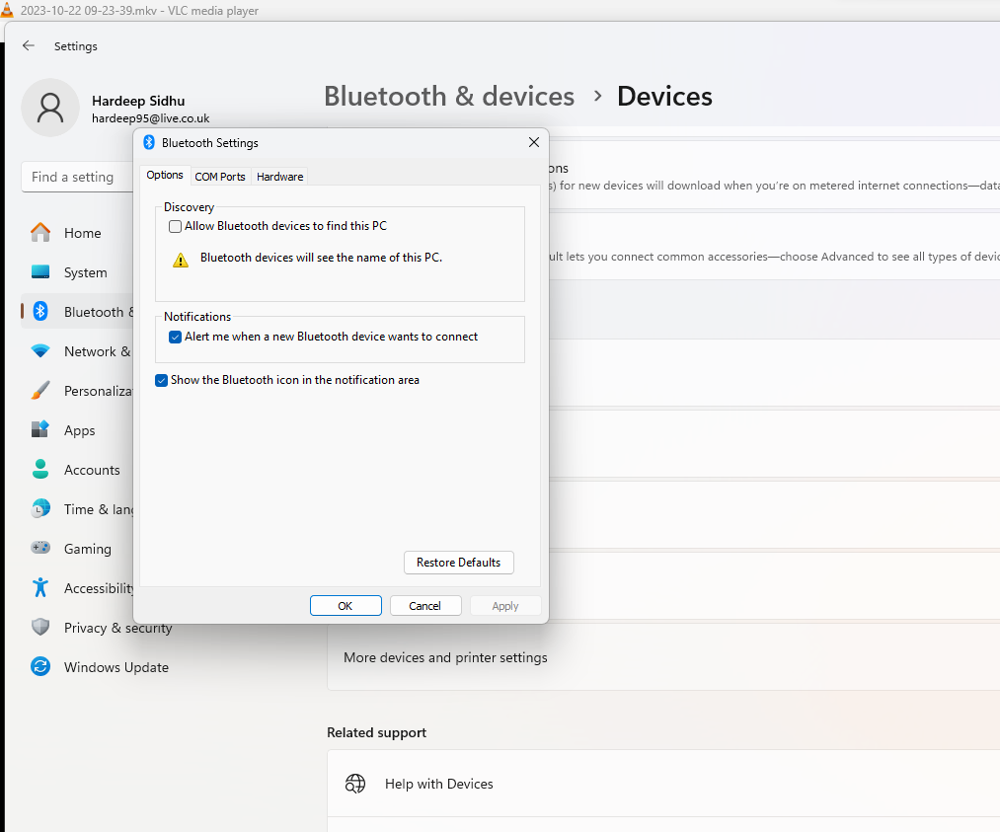
12. select COM Ports at the top and make note of the outgoing port for the device. It is COM5 in this example:
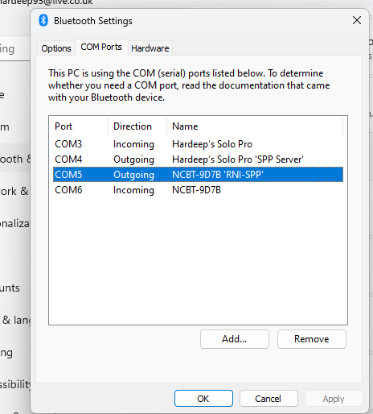
13. Connect the connector from the EEG hat to flex eeg as shown by these images: 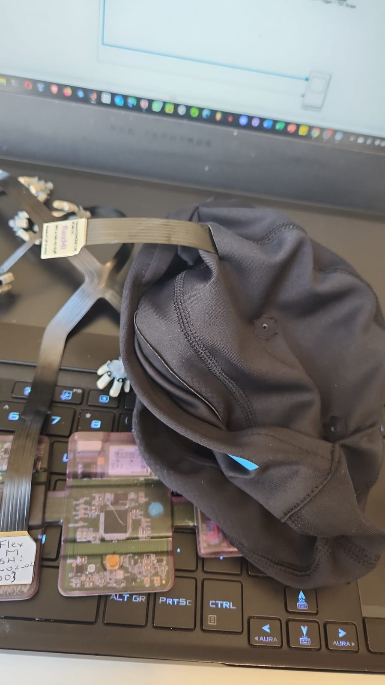
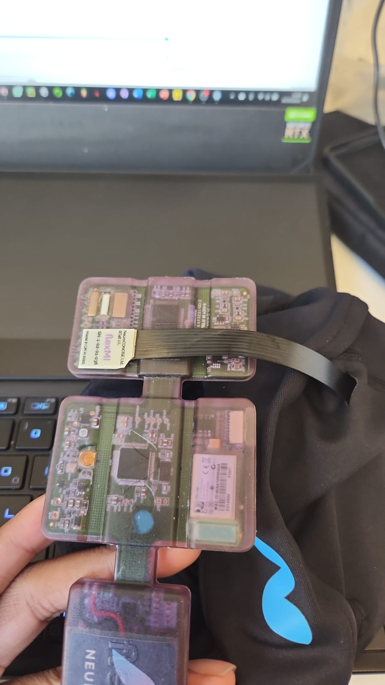
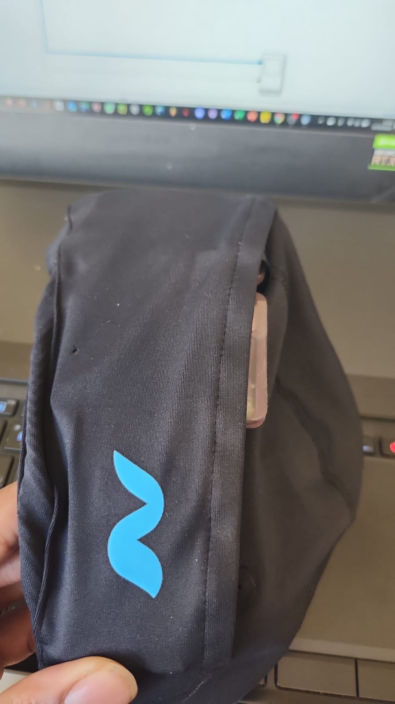
14.  Go back to MATLAB and navigate to the code folder. You can do this on the command window with: 
~~~
cd ../../../../Code
~~~
15. Open TrueStart_FBCSP22.m and TI_TA_TM.m
16. Run TrueStart_FBCSP22.m either via the run menu option in editor or with:
~~~
run('TrueStart_FBCSP22.m')
~~~
If successful then a pop up will appear and ask you to save, type n for no and click ok.
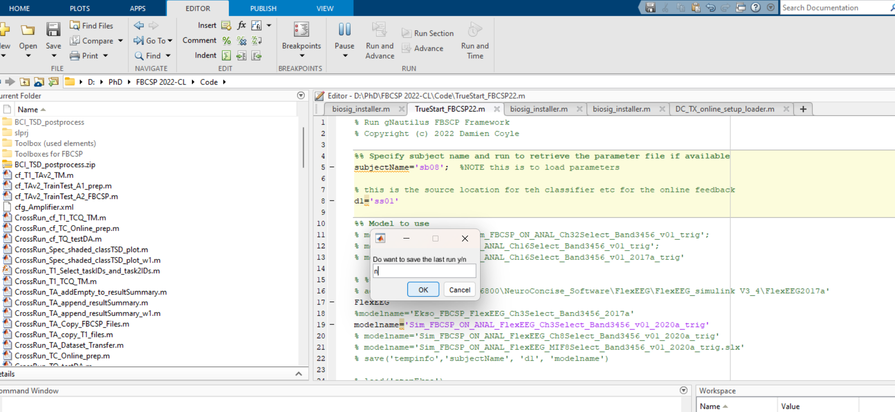
If you get an error similar to:
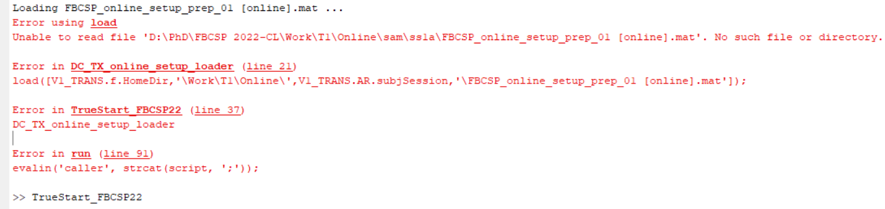
Then you will need to go into the TrueStart file and change the subject name and d1 to match a file path inside of Work/T1/Online/$subjectName$/$d1$ to allow the script to find FBCSP_online_setup_prep_01.mat 
Here is an example of dinding the file:
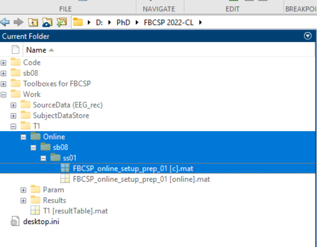
And here is an example of chaning the correct paramters to fix this up:
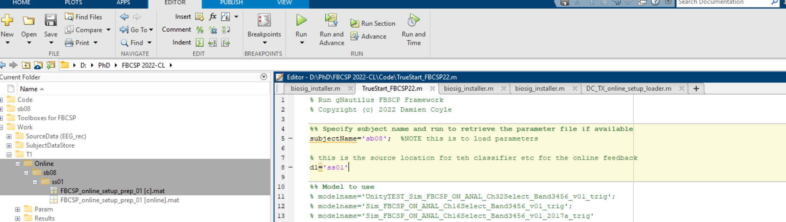
17. Once TrueStart has ran, a simulink window will open:
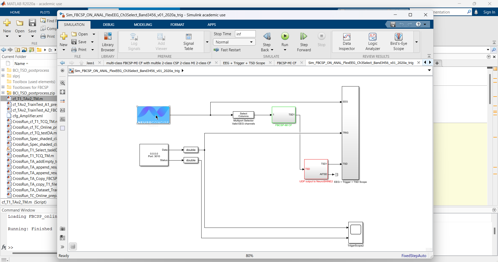
Our next task is to confirm that we have the correct COM port in the Simulink. This can be done by double clicking on the FlexEEG box with the NeuroConcise logo to get this screen:
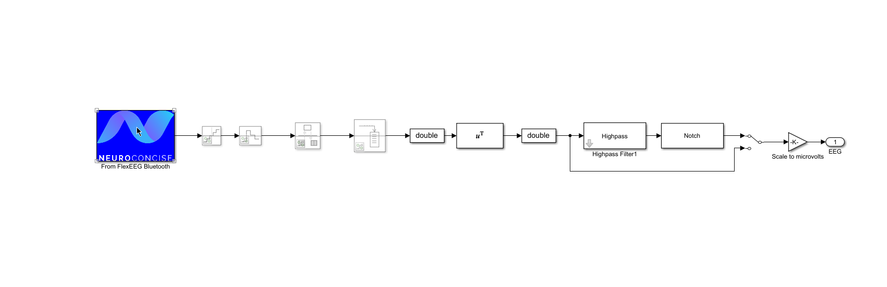
Then double click on the Neuroconcise logo with From FleEEG Bluetooth box to get this pop up:
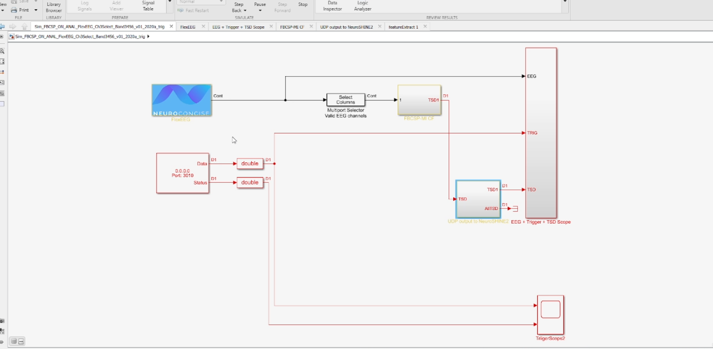
Double click on the FlexEEG box to get this screen:
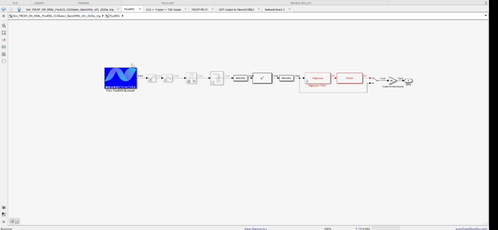
Double click on the From FleEEG Bluetooth box to get this pop-up on which we can confirm that the correct COM port is being used.
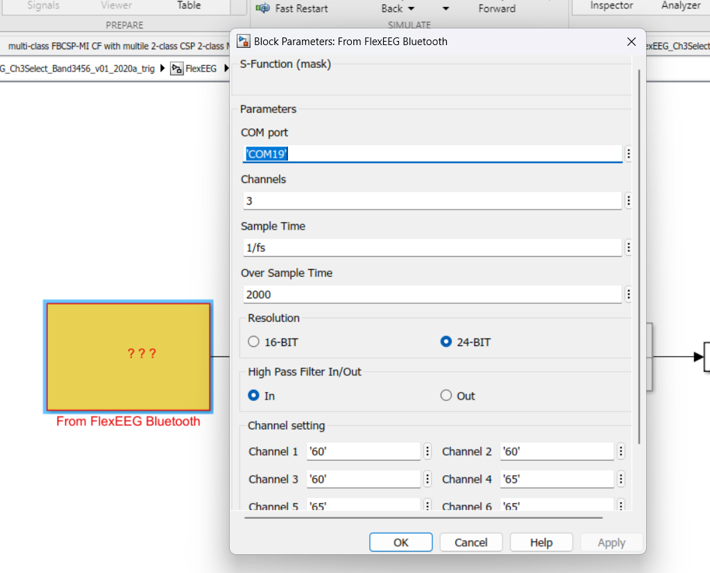
If you change the COM port, ensure you click Apply and Ok.
Note- If the neuroconcise logo is missing you will get a yellow box with ??? inside of it. This is only a visual bug, it will not affect performance.
Here is an image of the matching COM ports (and a missing logo):
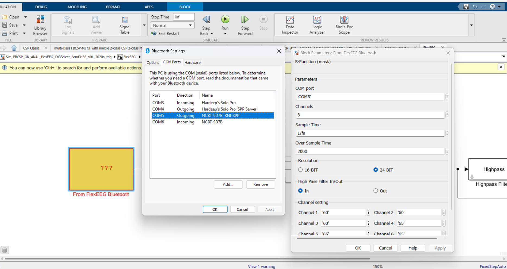
1.  TO BE CONTINUED (WIP)

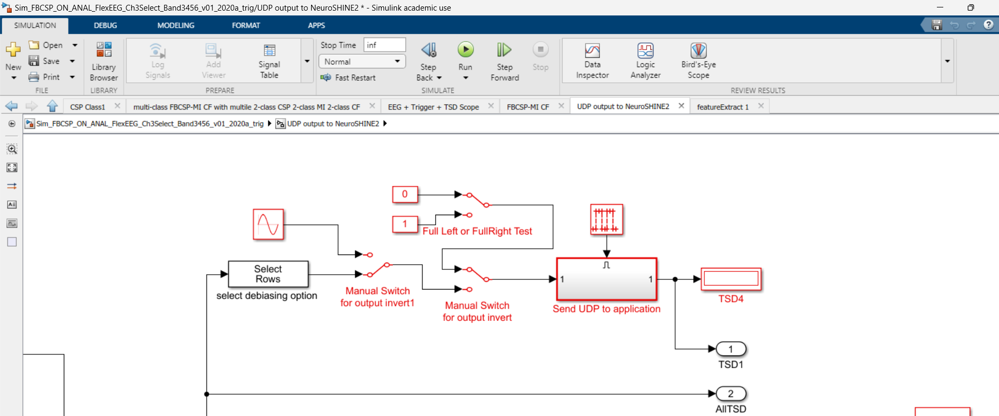](image-21.png)
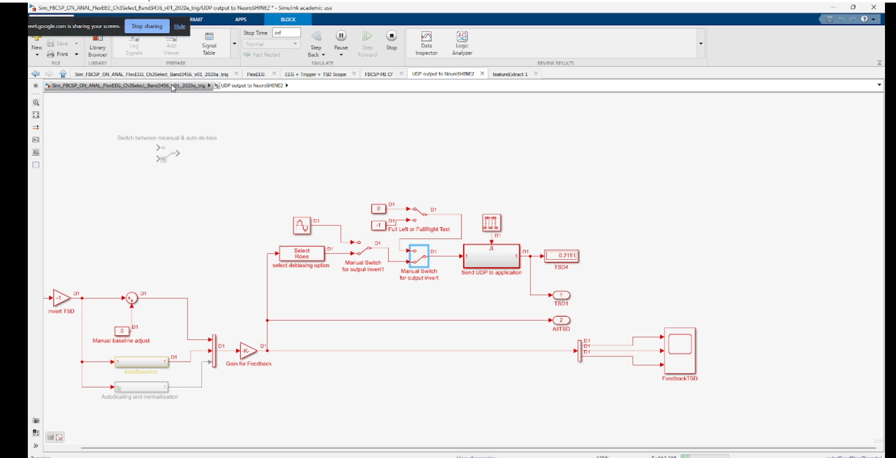